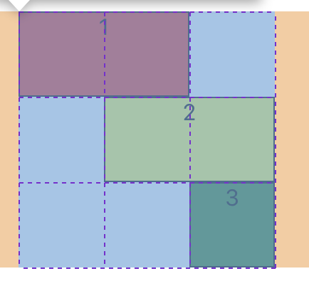

网格布局容器内部可以分割成多行多列的网格，相比于弹性布局的项目只能根据主轴和交叉轴排列，网格布局更加强大，通过 display: grid;或者 display: inline-grid;声明一个网格容器，有以下几个概念

- row line: 行线
- column line: 列线
- track: 网格轨道，即行线和行线，或列线和列线之间所形成的区域，用来摆放子元素
- gap: 网格间距，行线和行线，或列线和列线之间所形成的不可利用的区域，用来分隔元素
- cell: 网格单元格，由行线和列线所分隔出来的区域，用来摆放子元素
- area: 网格区域，由单个或多个网格单元格组成，用来摆放子元素

#### 容器属性

##### 网格轨道

grid-template-columns 用来定义每一列的列宽，grid-template-rows 用来定义每一行的行高

```css
/* 定义了三列，每列宽可以分别设置 */
grid-template-columns: 33.33% 33.33% 33.33%;
grid-template-columns: 30% 50px auto;

/* 一个 fr 单位代表网格容器中可用空间的一等份，如下均分了三列 */
grid-template-columns: 1fr 1fr 1fr;
/* 空间减去50px后再三等分 */
grid-template-columns: 50px 1fr 1fr 1fr;

/* 标记来重复部分或整个轨道列表，第二个参数可以用绝对单位、百分比、fr */
grid-template-columns: repeat(3, 33.33%);
/* 100px 20px 80px重复两次，也就是生成了6条轨道 */
grid-template-columns: repeat(2, 100px 20px 80px);
/* 混合使用 */
grid-template-columns: 20px repeat(2, 1fr);

/* minmax(min, max)表示取大于等于 min 且小于等于 max 的值，如果 max 小于 min 就取 min */
/* 关键字max-content和min-content表示以网格项的最大/最小的内容来占据网格轨道 */
grid-template-columns:
  minmax(100px, max-content)
  repeat(auto-fill, 200px) 20%;

/* 设置轨道的同时可以定义网格线名称 */
grid-template-columns: [first] 50px [line2]50px [line3]50px;
grid-template-columns: repeat(3, [col-start] 33.33%);
```

grid-template-columns 和 grid-template-rows 按行列的顺序简写成以下形式

```css
grid-template: 100px 100px 100px / 100px 100px 100px;
```

##### 网格间距

grid-row-gap 设置行间距，grid-column-gap 设置列间距

```css
grid-row-gap: 20px;
grid-column-gap: 20px;

/* 按行列的顺序简写以下形式 */
grid-gap: <grid-row-gap> <grid-column-gap>;
```

##### 网格区域

grid-template-areas 用来给网格区域命名，方便项目放到某个指定网格区域。区域的命名会影响到网格线命名，起始网格线自动命名为区域名-start，终止网格线自动命名为区域名-end

```bash
# 三行三列，点表示一个空的单元格
grid-template-areas:
  'a a b'
  'c d e'
  'c d .';
```

##### 网格对齐方式

justify-content 属性是整个内容区域在容器里面的水平位置，align-content 属性是整个内容区域的垂直位置，注意是整体。有以下几种取值

- start：对齐容器的起始边框
- end ：对齐容器的结束边框
- center：容器内部居中
- stretch：默认，项目大小没有指定时，拉伸占据整个网格容器
- space-around：每个项目两侧的间隔相等，项目之间的间隔比项目与容器边框的间隔大一倍
- space-between：项目与项目的间隔相等，项目与容器边框之间没有间隔
- space-evenly：项目与项目的间隔相等，项目与容器边框之间也是同样长度的间隔

##### 单元格对齐方式

justify-items 属性设置单元格内容的水平位置，align-items 属性设置单元格内容的垂直位置。有以下几种取值

- start：对齐单元格的起始边缘
- end：对齐单元格的结束边缘
- center：单元格内部居中
- stretch：默认，占满单元格的整个宽度

##### 自动布局方式

grid-auto-flow 属性控制着自动布局算法怎样运作，即元素怎样排列，有以下几种取值

- row：默认，通过填充每一行来放置网格元素，在必要时增加新行
- column：通过填充每一列来放置网格元素，在必要时增加新列
- dense：稠密堆积算法，如果后面出现了稍小的元素，则会试图去填充网格中前面留下的空白。这样做会填上稍大元素留下的空白，但同时也可能导致原来出现的次序被打乱
- row dense：按行来填充网格中前面留下的空白
- column dense：按列来填充网格中前面留下的空白

当我们在网格定义的区域外放置子元素时，或因子元素数量过多而需要更多的网格线时，布局算法就会自动生成隐式网格，默认情况下这些隐式网格的大小也会随着内容尺寸不同而变化，可以利用属性 grid-auto-rows 和 grid-auto-columns 来控制隐式网格的大小，语法类似 grid-template-columns

#### 项目属性

##### 项目位置

grid-column 和 grid-row 可以根据容器中设置的网格线名和区域名，指定项目的位置放在哪个网格区域

- grid-column-start：左边框所在的垂直网格线
- grid-column-end：右边框所在的垂直网格线
- grid-row-start：上边框所在的水平网格线
- grid-row-end：下边框所在的水平网格线

上面的属性可以简写为 grid-area，它还可以按区域名直接指定某个网格区域

```css
grid-area: <row-start> / <column-start> / <row-end> / <column-end>;
```

示例如下

```html
<div className="container">
  <div>1</div>
  <div>2</div>
  <div>3</div>
</div>
```

```css
.container {
  width: 180px;
  height: 180px;
  display: grid;
  grid-template-rows: 1fr 1fr 1fr;
  grid-template-columns: repeat(3, 60px [col-start]);
  grid-template-areas:
    'a a b'
    'c d e'
    'c d i';
}
.container div {
  border: 1px solid #000;
}

/* 将项目放置在水平网格线的第1条和第2条之间，垂直网格线的第1条和第3条之间 */
.container div:first-child {
  grid-row-start: 1;
  grid-row-end: 2;
  grid-column-start: 1;
  grid-column-end: 3;
  background: red;
}
/* 或者写成这样，关键字span可以跨越多个行数或列数，直到到达指定数目为止 */
.container div:first-child {
  grid-row: 1/2;
  grid-column: span 2;
  background: green;
}

/* 使用缩写形式 */
.container div:nth-child(2) {
  grid-row: 2/3;
  grid-column: 2/4;
  background: yellow;
}

/* 直接指定区域名 */
.container div:nth-child(3) {
  grid-area: i;
  background: green;
}
```



##### 对齐方式

容器设置单元格对齐方式是一起设置的，也可以单个项目设置单元格对齐方式

- justify-self：设置单元格内容的水平位置，和 justify-items 用法一致，只作用于单个项目
- align-self：设置单元格内容的垂直位置，和 align-items 用法一致，只作用于单个项目

```css
/* 简写 */
place-self：<justify-self> <align-self>
```

参考

1. [布局的神--网格布局最全总结，建议收藏](https://juejin.cn/post/7022985280386760740)
2. [CSS Grid 网格布局全攻略](https://juejin.cn/post/6844903891079790600)
